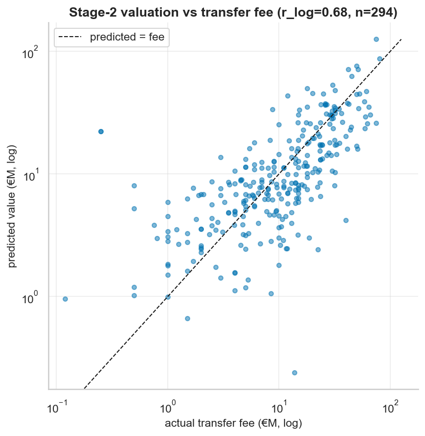

# Stage 2 — Transfer-Fee Validation (§11.4)

Predicted value (from PRE-transfer 2023-24 features) vs the ACTUAL 2024-25 fee. Fee is never a training target → external real-world check. *(2023-24 is a train season, so the MV prediction is in-sample; the fee comparison is not.)*

## Aggregate

| metric | value |
|---|---|
| matched transfers | 294 |
| median predicted/fee ratio | 0.97 |
| mean ratio | 1.89 |
| Pearson r (€ space) | 0.733 |
| Pearson r (log space) | 0.677 |
| R² (log space) | 0.429 |
| log MAE | 0.635 |

## Top-10 OVER-predicted (model ≫ fee)

| player | pos | fee €M | pred €M | ratio |
|---|---|---|---|---|
| Julián Álvarez | MID | 75.0 | 125.7 | 1.68 |
| Serhou Guirassy | FWD | 18.0 | 49.9 | 2.77 |
| Federico Chiesa | FWD | 12.0 | 43.5 | 3.62 |
| Conor Gallagher | MID | 42.0 | 71.1 | 1.69 |
| Xavi Simons | MID | 50.0 | 76.0 | 1.52 |
| Lutsharel Geertruida | DEF | 20.0 | 45.7 | 2.29 |
| Sergio Gómez | DEF | 8.7 | 33.6 | 3.86 |
| Santiago Gimenez | FWD | 30.2 | 53.3 | 1.76 |
| Ayanda Sishuba | MID | 0.2 | 22.4 | 89.50 |
| Ayanda Sishuba | MID | 0.2 | 22.4 | 89.50 |

## Top-10 UNDER-predicted (model ≪ fee)

| player | pos | fee €M | pred €M | ratio |
|---|---|---|---|---|
| Omar Marmoush | FWD | 75.0 | 26.1 | 0.35 |
| Leny Yoro | DEF | 62.0 | 25.7 | 0.42 |
| Abdukodir Khusanov | DEF | 40.0 | 4.2 | 0.10 |
| Amadou Onana | MID | 59.4 | 23.6 | 0.40 |
| João Neves | MID | 65.9 | 30.5 | 0.46 |
| João Palhinha | MID | 51.0 | 16.0 | 0.31 |
| Désiré Doué | MID | 50.0 | 16.9 | 0.34 |
| Pedro Neto | MID | 60.0 | 29.4 | 0.49 |
| Dominic Solanke | FWD | 64.3 | 35.3 | 0.55 |
| Elliot Anderson | MID | 41.2 | 16.1 | 0.39 |

## Per-position

| pos | n | median ratio | Pearson r (log) |
|---|---|---|---|
| DEF | 81 | 1.02 | 0.634 |
| FWD | 67 | 0.98 | 0.749 |
| GK | 21 | 1.12 | 0.809 |
| MID | 125 | 0.90 | 0.640 |

